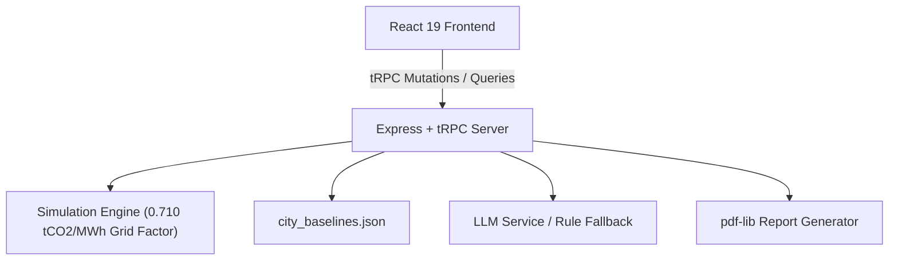

# EcoPolicy AI — Urban Climate Decision Studio

An interactive urban sustainability policy simulation dashboard that enables city planners, ESG analysts, and policy researchers to model the relative environmental impact of green policy interventions across Indian cities using transparent formulas and baseline datasets.

---

## 📌 Executive Overview & Data Methodology

**EcoPolicy AI** is a scenario simulator designed for conceptual decision-support and policy exploration. It models how changing policy levers shifts key metrics (**CO₂ Emissions**, **Air Quality Index (AQI)**, **Electricity Demand**, and **Green Sustainability Score**) relative to a baseline city profile.

### Simulation Model & Formulas
- **Grid Carbon Intensity:** Uses the Central Electricity Authority (CEA) National Electricity Plan grid emission factor of **0.710 tCO₂ / MWh**.
- **Tree Carbon Sequestration:** Modeled at **0.021 tCO₂ / tree / year** based on urban forestry estimates.
- **Transport & EV Impact:** Models tailpipe emission reductions and grid load adjustments as EV adoption and public transit usage increase.
- **City Baselines:** Contains baseline parameters for 15 major Indian cities (Delhi, Mumbai, Bengaluru, Ahmedabad, Surat, Chennai, Kolkata, Pune, Hyderabad, Jaipur, Lucknow, Kanpur, Nagpur, Indore, Agra). Any custom or unlisted city defaults to a standard planning baseline.
- **Nature of Outputs:** Results represent comparative scenario shifts rather than deterministic forecasts.

---

## ✨ Key Features

1. **City Selection & Custom Cities:**
   - Pre-configured baselines for 15 Indian cities + automatic fallback baseline for custom user-added cities.
   - Duplicate city prevention logic that automatically redirects users to existing city entries.

2. **5 Core Policy Levers (0% – 100%):**
   - 🚗 **EV Adoption Rate**
   - ☀️ **Solar Energy Deployment**
   - 🌳 **Urban Afforestation / Tree Planting**
   - ♻️ **Plastic & Solid Waste Recycling**
   - 🚌 **Public Transit Utilization**

3. **AI Policy Optimizer:**
   - Recommends target policy lever values customized to user priorities (*Reduce CO₂*, *Improve Air Quality*, *Reduce Energy*, *Maximize Green Score*, *Balanced*).

4. **Analytical Panels & Dashboards:**
   - **AI Policy Insights:** Multi-turn AI text explanations powered by LLM endpoints with deterministic fallback support.
   - **Economic Impact Panel:** Estimated CAPEX, OPEX, annual cost savings, and green job creation metrics based on lever scale.
   - **Climate Risk Score:** Evaluates city vulnerability level based on CO₂, AQI, and Green Score shifts.
   - **Feature Importance Panel:** Visualizes relative weight contributions of policy levers toward Green Score changes.
   - **Scenario Management:** Save, load, delete, and compare up to 4 simulation scenarios side-by-side.

5. **PDF ESG Report Export:**
   - Generates a downloadable 3-page dark-themed PDF report (using `pdf-lib`) containing KPI snapshots, policy lever bars, detailed metric shift tables, and AI recommendations.

---

## 🛠️ Technology Stack

- **Frontend:** React 19, Tailwind CSS v4, shadcn/ui, Recharts, Wouter
- **Backend API:** Node.js, Express, tRPC (Type-safe client-server procedures)
- **Database & ORM:** Drizzle ORM, MySQL (for authentication & schema management)
- **PDF Generation:** `pdf-lib` (built with WinAnsi-compliant character encoding)
- **AI Integration:** LLM integration via Manus Built-in Forge API with fallback synthesis



---

## 🚀 Local Development & Setup

### Prerequisites
- Node.js (v18+)
- `pnpm` or `npm`

### Installation

1. **Clone the repository:**
   ```bash
   git clone <repository-url>
   cd ecopolicy-ai
   ```

2. **Install dependencies:**
   ```bash
   npm install
   ```

3. **Configure Environment Variables (Optional):**
   - `BUILT_IN_FORGE_API_KEY`: API key for generative AI policy insights.
   - `DATA_GOV_IN_API_KEY` & `DATA_GOV_IN_RESOURCE_ID`: For live CPCB AQI data integration.

4. **Run Development Server:**
   ```bash
   npm run dev
   ```
   Open `http://localhost:5000` (or the printed port) in your browser.

---

## 🎯 Sustainable Development Goals (SDGs)

- **Goal 7: Affordable and Clean Energy** — Modeling solar adoption and grid electricity demand.
- **Goal 11: Sustainable Cities and Communities** — Evaluating urban air quality, public transit, and green infrastructure.
- **Goal 13: Climate Action** — Quantifying CO₂ emission reductions across urban policy scenarios.

---

## 🌫️ Hyperlocal Air Quality Forecasting + Personalized Health Risk Alerts

### Problem

Monitoring stations provide pollution measurements only at specific locations. This makes it difficult to know the pollution level at locations between monitoring stations.

### Proposed Solution

Our system will combine air-quality observations, weather information and spatial-temporal machine learning to estimate and forecast hyperlocal PM2.5 levels.

The system will also estimate prediction uncertainty and generate personalized health-risk alerts.

### Target

- **Pollutant:** PM2.5
- **Spatial resolution:** 1 km × 1 km
- **Forecast horizons:** 1h, 3h, 6h

### Main Components

1. Data collection
2. Data preprocessing
3. Spatial interpolation
4. PM2.5 forecasting
5. Uncertainty estimation
6. Personalized risk engine
7. Dashboard
